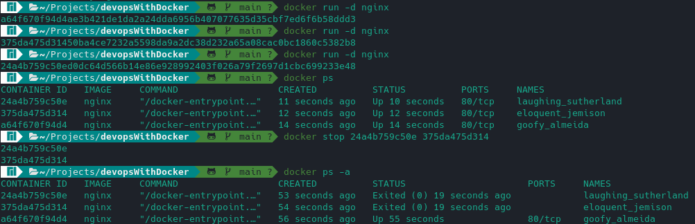
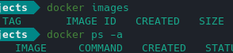
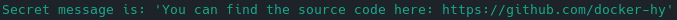
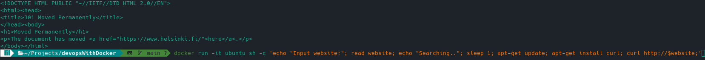
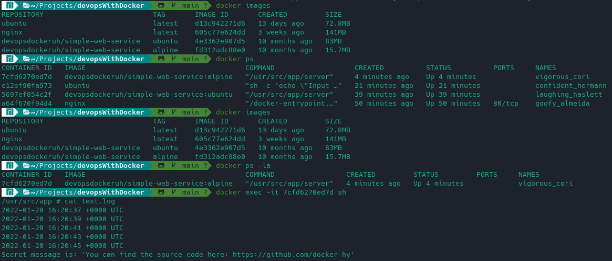
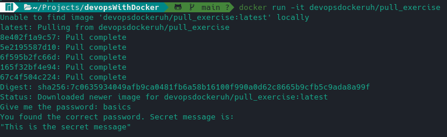
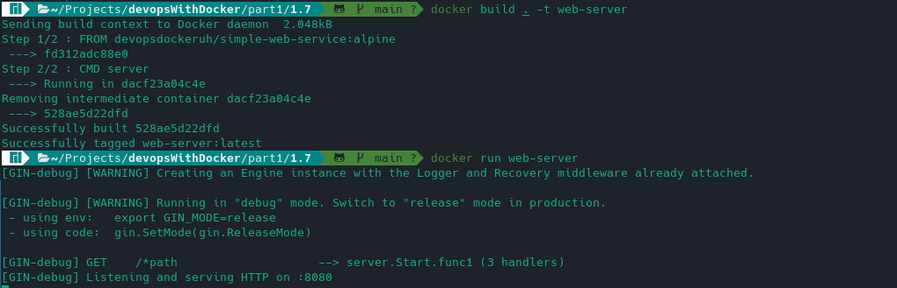
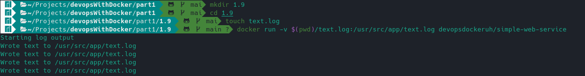
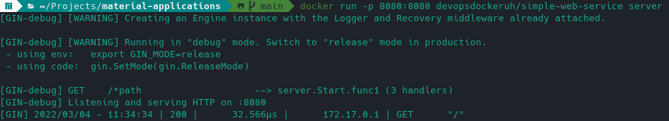

## Exercise 1.1 Getting started



## Exercise 1.2: Cleanup



## Exercise 1.3: Secret message



The command to get into the container was 
```
docker exec -ti 73627f65da37 /bin/bash     
```


## Exercise 1.4: Missing dependencies



## Exercise 1.5: Sizes of images



## Exercise 1.6: Hello Docker Hub



## Exercise 1.7: Two line Dockerfile



The dockerfile can be found in the 1.7 folder. 

## Exercise 1.8: Image for script

The dockerfile can be found in the 1.8 folder. 

## Exercise 1.9: Volumes



## Exercise 1.10: Ports open



## Exercise 1.11: Spring

The dockerfile can be found in the 1.11 folder. 

## Exercise 1.12 - 1.14 Hello frontend, backend and environment

The dockerfiles including environment variables are found in [1.12](https://github.com/thomsva/devopsWithDocker/tree/main/part1/1.12) and [1.13](https://github.com/thomsva/devopsWithDocker/tree/main/part1/1.13) folders. The command for running the backend and the frontend were

```
docker run -p 8080:8080 example-backend  
docker run -p 5000:5000 example-frontend   
```
## Exercise 1.15: Homework

The dockerfile of a very simple app can be found in [Dockerhub](https://hub.docker.com/repository/docker/thomsva/hello-docker).

## Excercise 1.16 Heroku

The url to the released application is https://ts-1-16.herokuapp.com/